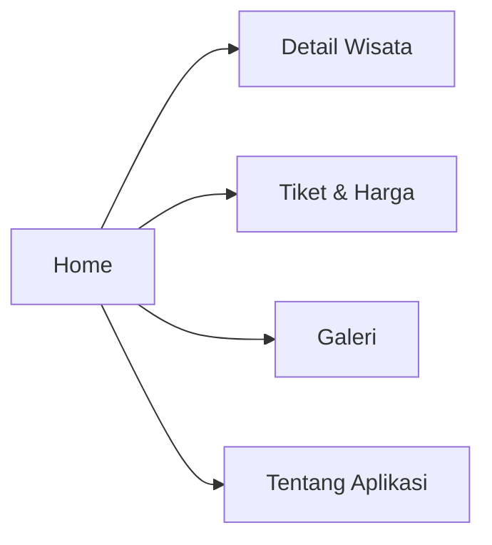

# 🏔️ Wisata Rinjani
### *Your Digital Guide to Mount Rinjani Adventures*

> A Flutter mobile application that presents information about Mount Rinjani tourism with modern UI and smooth navigation using GetX.

---
## ✍️ Dibuat Oleh

**Revalina Fidiya Anugrah**  
NIM: **H1D023011**

## 🔰 Tech & Tools Used

| Teknologi | Keterangan |
|----------|-------------|
| Flutter | Framework UI |
| Dart | Bahasa Pemrograman |
| GetX | State Management & Routing |
| Modular GetX | Arsitektur folder |
| Poppins Font | Typography |
| Earthy UI Theme | Desain Warna |

---

## 📱 UI Showcase


### 🧵 **Mockup Screenshot Showcase**  
*(Tambahkan screenshot dengan frame mockup HP di setiap section)*

#### 📍 Home Page – Mockup Placeholder
```
mohon maaf sebentar pak lagi kelas belum sempat ss 
```

#### 🗻 Detail Wisata – Mockup Placeholder
```
mohon maaf sebentar pak lagi kelas belum sempat ss 
```

#### 🎟️ Tiket & Harga – Mockup Placeholder
```
mohon maaf sebentar pak lagi kelas belum sempat ss 
```

#### 🖼️ Galeri – Mockup Placeholder
```
mohon maaf sebentar pak lagi kelas belum sempat ss 
```

#### ℹ️ Tentang Aplikasi – Mockup Placeholder
```
mohon maaf sebentar pak lagi kelas belum sempat ss 
```

---


## 🚀 Fitur Utama

✨ Modern Card UI  
✨ GetX Navigation (Get.toNamed)  
✨ Floating Bottom Navigation Bar  
✨ 5 Halaman Utama:  
- Home (Daftar Wisata)  
- Detail Wisata  
- Tiket & Harga  
- Galeri Foto  
- Tentang Aplikasi  

🎁 **Bonus:** Custom Widget → `DestinationCard`

---

## 🎨 UI Style Guide

### 🌈 Warna Utama

| Nama | Hex | Digunakan pada |
|--------|--------|--------------------------|
| Cream | `#F7F1DE` | Background |
| Latte Brown | `#C4A484` | Aksen & Icon Aktif |
| Cinnamon Brown | `#B87C4C` | AppBar & BottomNav |

### 🔤 Typography

Font: **Poppins**  
Ukuran rekomendasi:  
- Title: 22–26 bold  
- Regular Text: 14–16  
- Caption: 12  

---

## 🧭 Navigasi Aplikasi



Routing seluruh halaman menggunakan **Get.toNamed()**.

---

## 📂 Struktur Folder Proyek

```
lib/
├── main.dart
└── app/
    ├── routes/
    │   └── app_pages.dart
    ├── modules/
    │   ├── about/
    │   │   ├── about_binding.dart
    │   │   ├── about_controller.dart
    │   │   └── about_view.dart
    │   ├── detail/
    │   │   ├── detail_binding.dart
    │   │   ├── detail_controller.dart
    │   │   └── detail_view.dart
    │   ├── gallery/
    │   │   ├── gallery_binding.dart
    │   │   ├── gallery_controller.dart
    │   │   └── gallery_view.dart
    │   ├── home/
    │   │   ├── home_binding.dart
    │   │   ├── home_controller.dart
    │   │   └── home_view.dart
    │   ├── ticket/
    │   │   ├── ticket_binding.dart
    │   │   ├── ticket_controller.dart
    │   │   └── ticket_view.dart
    ├── widgets/
    │   └── destination_card.dart
```

---

## ▶️ Cara Menjalankan

```bash
flutter pub get
flutter run
```

---


